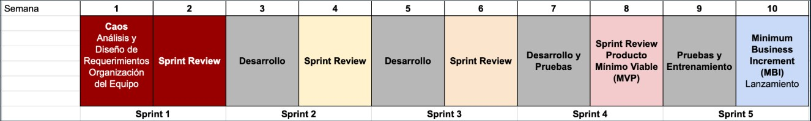

# TC2007B - Integración de seguridad informática en redes y sistemas de software.

## Reto
[Descripción de Reto](https://docs.google.com/document/d/12nZ1qbT4GDq9uWYvZXYNcMZ_70WpESA9OkysxWUXYEc/edit?usp=sharing)

## Plan de Evaluación Reto

### **Total de la calificación Final: 47%**

## Link Discord
[Discord](https://discord.gg/A2BWyf798)

## Index
[Módulo 3 - Móviles (DAM)](/mobile/README.md)

[Módulo 4 - Ingeniería de Software (IS)](/software_engineering/README.md)

[Módulo 5 - Administración de Proyectos (ADM)](/project_admin/README.md)
